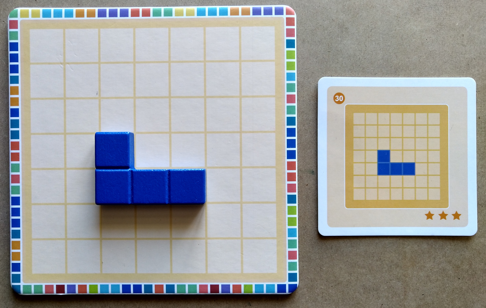

# polyssimo
So I found this tetris-reminiscent [puzzle game by Alain Brobecker](http://abrobecker.free.fr/jeux/#polyssimo) at a friend's place. The goal is to tile a 7-by-7 square using wooden pieces, starting from a given configuration. Here's an example:

We solved most of the puzzles fairly quickly, except for challenge number 30, shown below, which stubbornly resisted all our attempts:

To save my dignity (at least to some extent), I decided to create this little notebook. It uses JAX to find possible tile placements (using convolutions), which allows pruning the search tree if the board can't be covered or tiles cannot be placed anymore. Unfortunately, the logic is not jittable, so it's not particularly fast, but it does find the solution to the infamous challenge number 30 in about 5 minutes:

